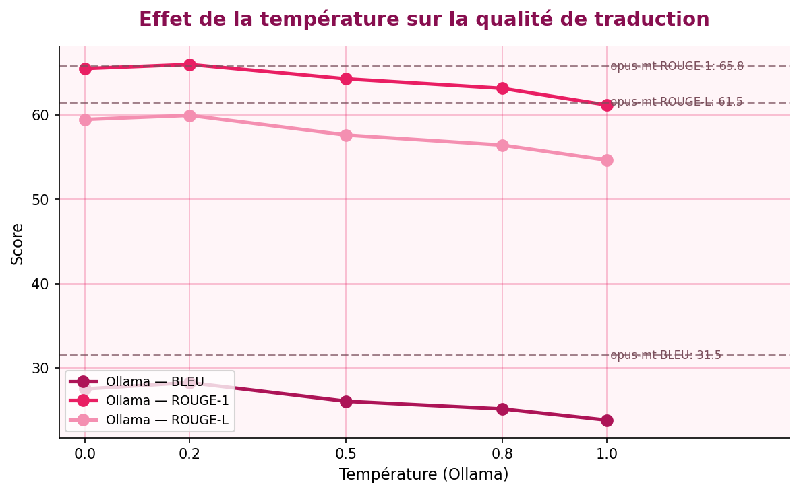

# Démo de traduction automatique dans le domaine de la santé mentale

Démo de traduction automatique anglais -> français comparant un LLM local via Ollama
et un modèle dédié HuggingFace (Helsinki-NLP/opus-mt-en-fr), évaluée avec BLEU et
ROUGE, et déployée via une interface Gradio.

Le corpus de référence est construit à partir des fiches d'information de l'OMS sur les
troubles mentaux (dépression, schizophrénie, trouble bipolaire, démence, troubles
anxieux), disponibles en anglais et en français officiel (la version française servant de
traduction humaine de référence).

---

## 1. Contenu du dossier

| Fichier | Rôle |
|---|---|
| `build_dataset.py` | Télécharge les fiches OMS (EN + FR) et aligne les phrases (LaBSE) -> `who_mental_health_en_fr.csv` |
| `translate.py` | Fonctions de traduction : Ollama (LLM local) et HuggingFace (opus-mt) |
| `evaluate.py` | Calcule BLEU/ROUGE sur 5 températures (0, 0.2, 0.5, 0.8, 1.0) |
| `app.py` | Interface interactive Gradio |
| `requirements.txt` | Dépendances |

---

## 2. Installation et exécution

### En local
```bash
pip install -r requirements.txt

# Ollama (https://ollama.com)
ollama serve &
ollama pull llama3.2

python build_dataset.py      # création du dataset
python evaluate.py           # évalue sur les scores BLEU / ROUGE
python app.py                # l'interface et la dcémo se lancent sur ' sur http://localhost:7860
```

---

## 3. Jeu de données

- **Source** : fiches d'information de l'OMS sur les troubles mentaux.
- **Méthode d'alignement** : chaque phrase française est appariée à la phrase anglaise la
  plus proche sémantiquement (embeddings **LaBSE**, seuil de similarité cosinus ≥ 0,70).
  Cette approche est robuste aux différences de mise en page entre les pages EN et FR.
- **Format** : `source_en, reference_fr, similarity, topic`.
- **Licence** : contenu OMS sous CC BY-NC-SA 3.0 IGO (usage académique / non commercial,
  attribution à l'Organisation mondiale de la Santé).

> Si le téléchargement échoue (réseau), le script bascule sur un petit jeu de secours
> clairement étiqueté afin que le projet reste exécutable.

---

## 4. Modèles comparés

| Modèle | Type | Température |
|---|---|---|
| `llama3.2` (via Ollama) | LLM génératif local | testée : 0 / 0.2 / 0.5 / 0.8 / 1.0 |
| `Helsinki-NLP/opus-mt-en-fr` | Modèle de traduction dédié (Marian) | n/a (déterministe) |

**Remarque importante** : le modèle opus-mt est déterministe ; la notion de température ne
s'y applique pas de façon significative. La variation de température concerne donc le LLM
Ollama, ce qui constitue l'un des points d'analyse du rapport.

---

## 5. Résultats

=== RESUME (scores moyens) ===

Modele              Temp     BLEU   ROUGE-1   ROUGE-L
-----------------------------------------------------
HF opus-mt           n/a    31.49     65.81     61.53
Ollama llama3.2      0.0    27.49     65.51     59.46
Ollama llama3.2      0.2    28.24      66.0     59.95
Ollama llama3.2      0.5    26.03     64.28     57.62
Ollama llama3.2      0.8    25.12     63.15     56.42
Ollama llama3.2      1.0    23.79     61.18     54.64

### Analyse (à rédiger)
Quelques pistes d'observation attendues :
- **Effet de la température** : les scores diminuent de manière monotone quand la température 
augmente, ce qui confirme que la traduction est une tâche à faible entropie où l'échantillonnage 
aléatoire nuit à la fidélité.



- **LLM généraliste vs modèle dédié** :  opus-mt (spécialisé) devance llama3.2 (généraliste) 
sur BLEU et ROUGE-L, l'écart étant plus marqué sur les métriques sensibles à l'ordre des mots 
qu'à T=0.2 — la meilleure config d'Ollama.
- **Limites de BLEU/ROUGE** : BLEU et ROUGE pénalisent les reformulations correctes mais différentes 
de la référence. Une partie de l'« écart » de llama3.2 vient peut-être de traductions valables formulées 
autrement.

---

## 6. Démo vidéo
> Ajoute ici le lien (ou le fichier `.mp4`) montrant l'app Gradio en fonctionnement.

---

## 7. Limites et pistes d'amélioration
- Corpus de taille modeste (quelques dizaines à centaines de phrases).
- BLEU/ROUGE corrèlent imparfaitement avec la qualité perçue ; un score comme COMET ou
  une évaluation humaine compléterait utilement l'analyse.
- Possibilité d'élargir le corpus (corpus médical EMEA via OPUS) pour plus de robustesse.
